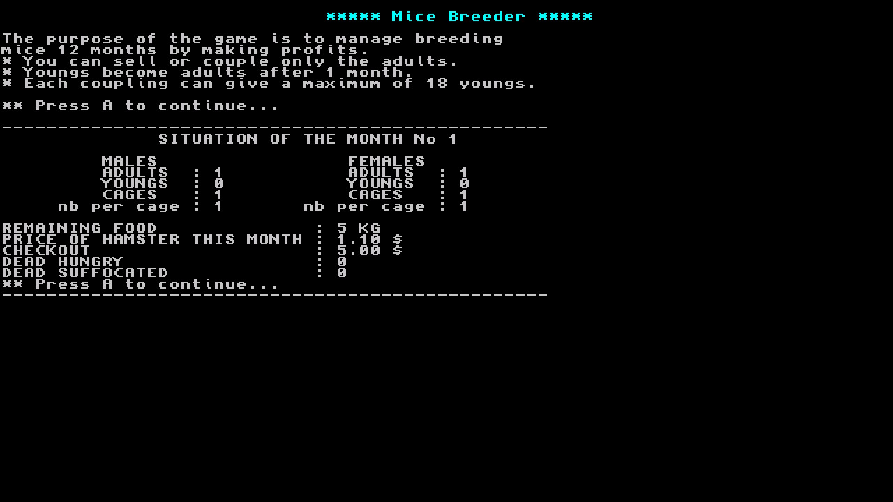

# Mice Breeder
A breeding of Mice game in text mode for the Nintendo Switch.

I used Hamster NX (https://github.com/Cid2mizard/Hamsters_NX/) as a base. Thanks to Cid2mizard

you need homebrew-enabled switch to run this game.  

Controls:

Right & Left : +/- 1

Up & Down : +/- 10

R & L : +/- 100

A : Next step

Plus : Exit

Changelog:   
removed french stuff and made variables into english made code easily readable and understandable.  
v1.0 Initial Release  
Use libnx from switchbrew   

 

Thanks/Credit to:  
https://github.com/switchbrew for Switch dev stuff
Hamster NX (https://github.com/Cid2mizard/Hamsters_NX/)

